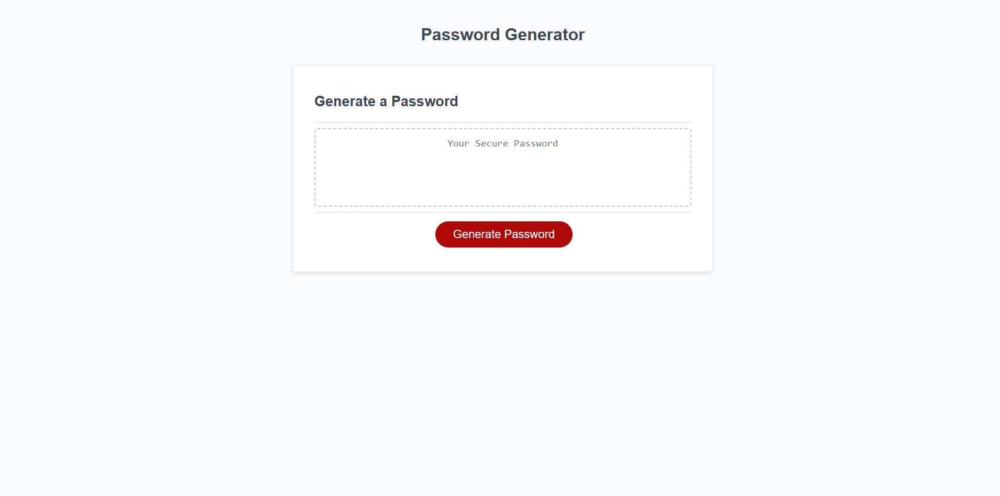
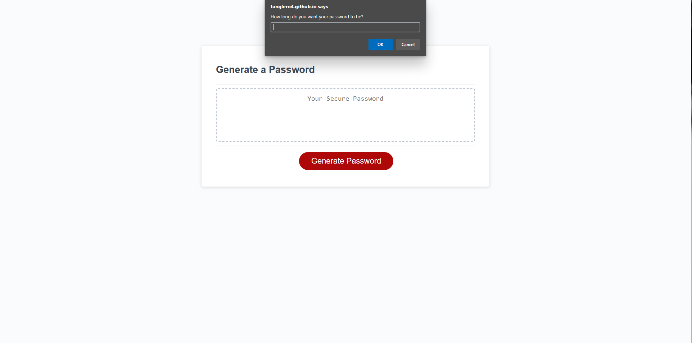
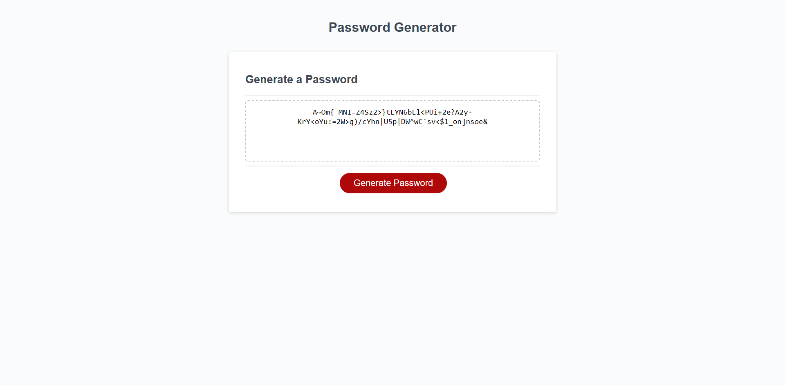

# Password-Generator

## Description

-This password generator was created to help user come up with a random password to log into apps or websites.
-You can choose from upper case letters , lower case letters, numbers and special characters.
-While building this portfolio I learned to combine functions and loops to generate random numbers and letters.

## Installation

N/A

## Usage

- Open up website: https://tanglero4.github.io/Password-Generator/
  
- Click on generate password button and answer the questions that pop up.
 
- Once completed the generated password will be displayed in the box on the middle of the page.
 
 

## Credits

UCF Coding Bootcamp

## License

N/A
